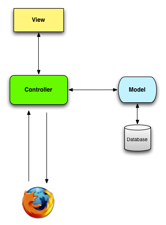
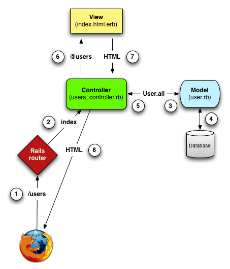
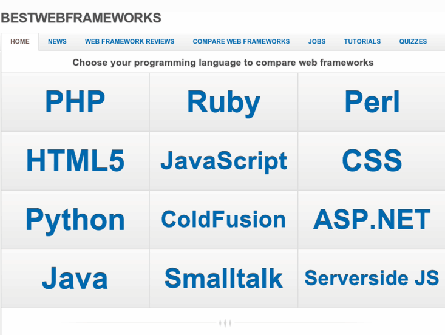
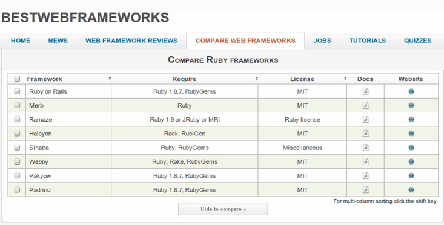

# Framework Nedir?

.fx: first

Gökhan Demir `<gdemir@bil.omu.edu.tr>`

[http://gdemir.me](http://gdemir.me)

Nisan 2012

---

# Framework Nedir ?

Framework, yazılımın iskeletini oluşturan, fonksiyon ve sınıflardan oluşan geniş
çaplı bir kütüphaneye sahip uygulama çatısıdır.

Framework proje sürecini hızlandırır, düzenli ve temiz kod yazımını
kolaylaştırır ve yazılıma belli bir standart kazandırır.

Türkiye'de henüz tam anlamıyla yaygınlaşmasa da, framework yapıları her geçen
gün popülaritesini arttırıyor.

---

# Framework Mimarileri

Örneğin,

Ruby geliştiricileri, Sinatra, Ruby on Rails gibi frameworkler kullanmaktadır ve
Ruby on Rails uygulamalarında Model-View-Controller (MVC) mimarisi kullanılır.
Temel olarak  Don't Repeat Yourself (DRY) felsefesi üzerine kurulmuştur.

Java geliştiriciler ise Tapestry, Spring gibi frameworkler kullanır ve
bunların temeli MVC'ye dayanmaktadır.

Php geliştiricileri, Zend, Yii gibi frameworkler kullanmaktadır.

---

# DRY - KISS - YAGNI

**DRY**

Don't Repeat Yourself » Kendini Tekrarlama

**KISS**

Keep It Simple, Stupid » Herşeyi Basit Tut

**YAGNI**

You Ain't Gonna Need It = İhtiyacın olmayacak!

---

# MVC(Model View Controller) Nedir ?

**Model :** Veritabanına kayıt girilmesi, kaydın güncellenmesi, kaydın getirilmesi
vb. işlemleri yaptığımız kısımdır. (Kısaca insert, update, delete ve select
işlemlerimizi yaparız.)

**View :** Uygulamanın ziyaretçilere(istemci) göründüğü kısımdır. Html, Css, JavaScript vb.
bu kısımda bulunur.

**Controller :** View ile model arasında köprü görevi görür. View'den gelen verileri
model'e gönderir ve işler. Aynı zaman da model'in işlediği verileri de view'e
aktarır. Bu yapı sayesinde kodlarımızı katmanlara ayırırız ve çok daha derli toplu bir
proje yapımız olur. Farklı yazılımcılar standartlaşmış kod yapısı sayesinde
projeyi çok daha kolay geliştirebilirler.

---

# MVC(Model View Controller) Şekil

---

# MVC(Model View Controller) Şekil Detay

---

# Framework Kullanmanın Avantajları

- Yazılım geliştiriciler framework'ün sunduğu kütüphaneyi kullanarak daha kısa
zamanda daha fazla iş üretebilmesi

- Daha düzenli bir yapı ortaya çıkarabilir ve dolayısı ile ileriye dönük çok daha
kolay geliştirilebilir(genelleştirilebilir) uygulamalar hazırlayabilmesi

- Yazılıma belli bir standart kazandırılması

- Çoğu framework'ün içinde MVC'yi barındırılması

- MVC'nin sunduğu tüm avantajlardan yararlanılması

- Bir çok yazılımcı tarafından test edilerek güvenlik ve performans optimizasyonlarının yapılmış olması

- Proje süreçlerini kolaylaştırması ve hızlandırması

---

# Framework Kullanmanın Avantajları

Örneğin, basit bir inşaat örneği verelim, eski usul beton atmak için; önce malzemenin
gelmesi, sonra kalaslardan kalıp çakılması, ardından betonun karılması ve
dökülmesi lazımdı. Eğer çocukluğunuzda ev yaptıranlara bakmışsanız bu süreci iyi
kötü hatırlayanlarınız olacaktır.

Günümüz koşullarında ise; kalıplar çelikten, hazır boyları var, kurması çok
kolay, hazır betonlar özel kamyonlarla ayağınıza geliyor. Kısaca kalıp hazırlama
ve beton karma gibi bir durum yok. Çok kısa sürede kalıplar çakılıp, beton
dokuluyor. 10 kata kadar bir hız söz konusu.

İşte frameworklerde size böyle bir destek sunarak, yaptığınız işin tanımı belli
ise, size hazır bileşenler sunar, siz bunları kullanarak cok daha hızlı bir
biçimde işinizi teslim edebilirsiniz.

---

# Framework Kullanmalı mıyım ?

Framework kullanmanın avantajlarından bahsettik. Ama **Her proje de
framework kullanın** gibi bir genelleme yapmak yanlış olur. Öncelikle
geliştireceğimiz uygulamayı iyi analiz edip, ihtiyaçlarımızı net olarak
belirlememiz gerekiyor. 5 sayfadan oluşan basit bir kurumsal site için
framework kullanmanın avantajdan çok dezavantaj sunması muhtemeldir.

Bu tür küçük projelerde iş yükü fazla değildir ve projenin kodlarının devamlı
geliştirilmesi gerekmez. O yüzden mesala statik php ile hazırlayarak performans
yönünden daha iyi bir sonuç elde edebiliriz.
Orta ve büyük çaplı projeler geliştiriyorsak, ekip halinde çalışmamız
gerekiyorsa bence framework kullanmak en iyi çözümlerden biri olacaktır.

Örneğin Video, haber, oyun portalları, arkadaşlık siteleri, blog uygulamaları
vb. genelde içinde çok fazla kod barındıran ve ileriye dönük devamlı
geliştirilmesi gereken projelerdir.
O yüzden işyükü fazla olan ve gelişime açık projelerde framework tercih ederek
ileride yaşayabileceğimiz sıkıntıları minumuma indirebilir, projenin hazırlanma
sürecini hızlandırabiliriz.

---

# Nasıl Bir Framework Kullanmalıyım ?

Bu oldukça çetrefilli bir sorudur.

Öncelikle yeni bir şey öğrenmenin en rahat yolu, o konu da kolayca yardım bulabilmektir.
Bu yüzden en çok örnek ve yardım alabileceğiniz frameworkleri yönelmeniz avantajınıza olur.

Örneğin,

Ruby on Rails, Sinatra, Tapestry, Spring, Zend, Yii gibi.

Ancak bu seçim yetmez. Çünkü bu frameworklerden de projenizin büyüklüğü/küçüklüğüne
göre de bir seçim yapmalısınız.

Örneğin,

küçük projelerde Sinatra, Tapestry, Zend  
büyük projelerde Ruby on Rails, Spring, Yii

---

#  Büyük Projeler İçin Frameworkler

Ruby nesne tabanlı olup oldukça sade ve kısa bir sözdizimine (syntax)
bir programlama dilidir. Rails ise ruby ile yazılan web üzerinde
veritabanına dayanan çalışmaları gerçekletirmeye yarayan bir frameworktur. Web site: [www.rubyonrails.org](www.rubyonrails.org)

Java frameworklerinden birisidir. Web site: [www.springsource.org](www.springsource.org)

Php frameworklerinden birisidir. Web site: [http://www.yiiframework.com](http://www.yiiframework.com)

---

# Parlayan Frameworkler

Node.js kolay, hızlı, ölçeklenebilir ağ uygulamaları oluşturmak için Chrome'un
JavaScript çalışma zamanı üzerine kurulmuş bir platformdur.

Ayrıntılı bilgi : [http://doc.roktas.me/node-intro](http://doc.roktas.me/node-intro)

---

# Frameworkler Ve Karşılaştırmaları

- web uygulamalar

[http://www.bestwebframeworks.com](http://www.bestwebframeworks.com)

[http://vschart.com/compare](http://vschart.com/compare)

- mobil uygulamalar

[http://www.markus-falk.com/mobile-frameworks-comparison-chart](http://www.markus-falk.com/mobile-frameworks-comparison-chart)

---

# Frameworkler Ve Karşılaştırmaları

---

# Frameworkler Ve Karşılaştırmaları

---

# Örnek Framework Projeleri

- web uygulamalar: [http://plan.mf.omu.edu.tr](http://plan.mf.omu.edu.tr)

- mobil uygulamalar: [http://ikitap.com](http://ikitap.com)
