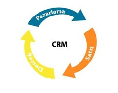
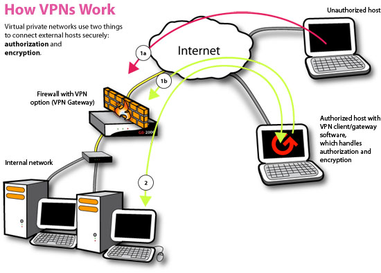
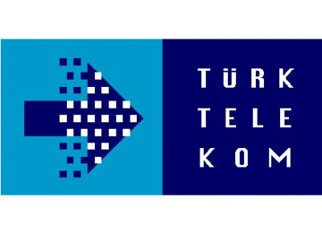

# Sonet

.fx: first

Gökhan Demir `<gdemir@sonet.com.tr>`

[http://sonet.com.tr](http://sonet.com.tr/)

Eylül 2013

---

## CRM Nedir?

CRM; (Customer Relationship Management) Müşteri İlişkileri Yönetimi anlamına
gelir ve  1990′lı yıllarda popülerleşmiş terimdir. Kurum,işletme ve kuruluşların
müşterileriyle olan  tüm etkileşimlerini koordine etmesini sağlayan uygulamalar
bütünüdür.

---

## VPN Nedir?

VPN (Virtual Private Network) internette başka bir network'e bağlanmanızı
sağlayan bağlantı türüdür.

VPN temel olarak sizin tüm internet trafiğinizi başka bir network'e
yönlendirerek sizin internet'te kim olduğunuzu gizleyerek gezinmenizi sağlar ki
VPN'in yararlı olmasının temel nedeni aslında budur. Çoğu işletim sistemi dahili
VPN'e bağlanma desteği vermektedir.

---

## TT Crm Nedir?

bla bla bla

---

## Sonet Crm Nedir?

bla bla bla 2
